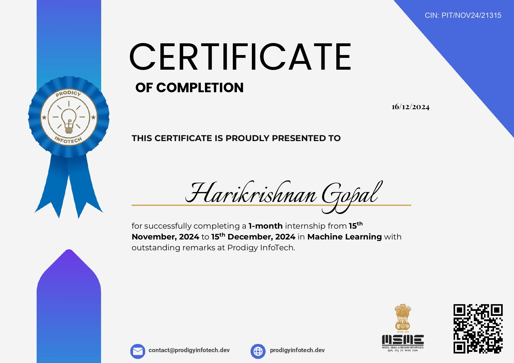

# Prodigy InfoTech Machine Learning Internship 🚀
This repository contains all the tasks and projects I completed as part of my internship at Prodigy Infotech.

## Overview
During my internship at Prodigy InfoTech, I had the incredible opportunity to work on four diverse and challenging machine learning projects, applying various algorithms and techniques to solve real-world problems.

## Internship Overview 📋 
- **Role**: Intern
- **Company**: Prodigy Infotech 
- **Duration**: November 2024 - December 2024
- **Focus Areas**: Python Programming, Machine Learning

---

## 🔬 Internship Projects

### Task 1: House Price Prediction 🏠
**Objective:** Implement a linear regression model to predict house prices
- **Techniques Used:** Linear Regression
- **Features:** Square footage, Number of bedrooms/bathrooms
- **Key Deliverables:** 
  - Predictive model
  - Data preprocessing scripts
  - Visualization of price trends

### Task 2: Customer Segmentation 🛒
**Objective:** Create a K-means clustering algorithm for retail customer analysis
- **Techniques Used:** K-means Clustering
- **Features:** Customer purchase history
- **Key Deliverables:**
  - Customer segments
  - Clustering visualization
  - Insights report

### Task 3: Image Classification - Cats vs Dogs 🐱🐶
**Objective:** Develop an SVM model to classify images of cats and dogs
- **Techniques Used:** Support Vector Machines (SVM)
- **Dataset:** Binary image classification
- **Key Deliverables:**
  - Trained classification model
  - Confusion matrix
  - Model performance metrics

### Task 5: Food Item Recognition and Calorie Estimation 🍲
**Objective:** Design a model to recognize food items and estimate calorie content
- **Techniques Used:** Deep Learning, Image Recognition
- **Features:** Food image analysis, Calorie estimation
- **Key Deliverables:**
  - Food recognition model
  - Calorie estimation algorithm
  - Detailed analysis report

---

## 📄 Official Documents

### Internship Verification 📝

#### Offer Letter:

#### Certificate of Completion:

#### Letter of Recommendation:

## 🛠 Technologies & Tools
- Python
- Machine Learning Libraries
- Scikit-learn
- Pandas
- NumPy
- Matplotlib
- TensorFlow/Keras

## 🏆 Key Learnings
- Advanced machine learning techniques
- Data preprocessing
- Model evaluation
- Practical application of ML algorithms

---

## 🔒 License
This project is open-source and available under the MIT License.
